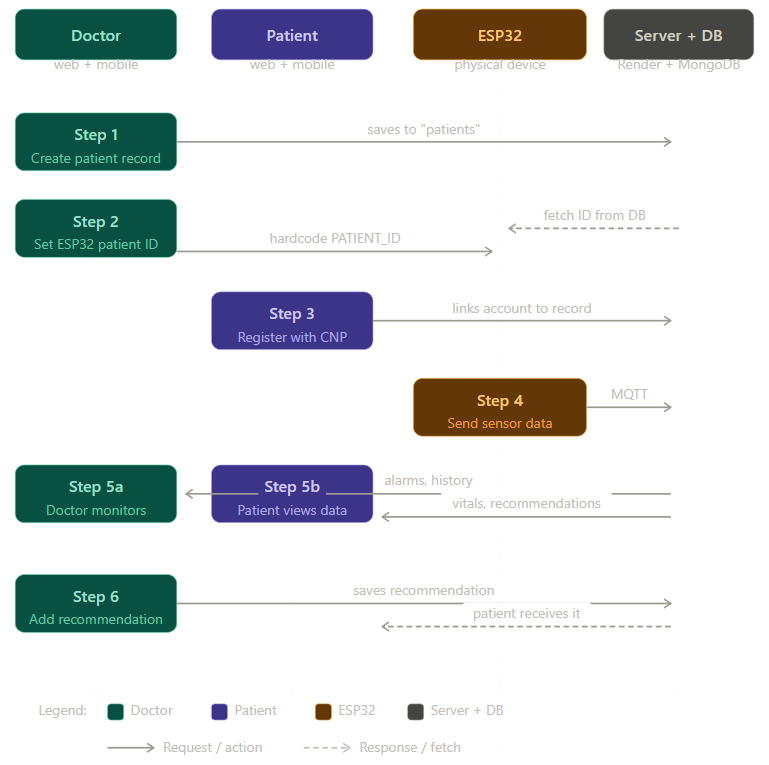

# IoT Health Monitor

A wearable health monitoring system for tracking patient vitals, developed as an academic project. Monitors physiological parameters (heart rate, temperature, ECG) through IoT sensors and presents data via web and mobile interfaces.

> Academic project — Politehnica University of Timișoara, Faculty of Automation and Computer Science

---

## System Flow



---

## System Architecture

```
ESP32 (sensors) → MQTT (HiveMQ) → Node.js Server (Render) → MongoDB Atlas
                                                           ↓
                                              Web App (React) / Mobile App (Expo)
```

The system is structured into 4 modules:

| Module | Technology | Description |
|--------|-----------|-------------|
| Hardware | ESP32 + DHT11 + MAX30105 + AD8232 | Sensor data collection |
| Backend | Node.js + Express + MongoDB + MQTT | Cloud server + REST API |
| Web App | React 19 + Vite | Doctor/admin interface |
| Mobile App | React Native + Expo | Patient interface |

---

## Hardware — ESP32

### Sensors
- **DHT11** (pin 4) — temperature and humidity, read every **3 seconds**
- **MAX30105** (I2C: SDA=21, SCL=22) — pulse oximeter, read every **10ms**
- **AD8232** (OUTPUT=36, LO-=35, LO+=32) — ECG, read every **5ms**

### Transmission
- Data sent via **MQTT** to `broker.hivemq.com` on topic `sanatate/senzori/date`
- Transmission frequency: **once per minute**
- Format: JSON with `id_pacient`, `puls_mediu`, `temperatura_medie`, `umiditate`, `ecg`

### ESP32 Configuration
```cpp
const char* WIFI_SSID     = "NETWORK_NAME";
const char* WIFI_PASSWORD = "WIFI_PASSWORD";
const char* PACIENT_ID    = "PATIENT_ID_FROM_MONGODB";
```

### Required Libraries (Arduino IDE)
- `PubSubClient` — Nick O'Leary
- `ArduinoJson` — Benoit Blanchon
- `DHT sensor library` — Adafruit
- `SparkFun MAX3010x` — SparkFun
- Board: **esp32 by Espressif Systems v2.0.17**

---

## Backend

**URL:** `https://beckend-medical.onrender.com`

### Technologies
- Node.js + Express
- MongoDB Atlas (cloud)
- MQTT (subscribes to ESP32 data)
- Deployed on Render.com

### MongoDB Collections
- `utilizatori` — user accounts (doctor, patient, admin)
- `pacienti` — patient records
- `masuratori` — sensor data (heart rate, temperature, ECG)
- `recomandari` — doctor recommendations for patients
- `alarme` — automatic alerts

### Run Locally
```bash
cd backend
npm install
npm start
```

---

## Web App

Interface for **doctors** and **administrators**.

### Features
- Authentication with automatic role-based redirect
- Doctor dashboard with patient list and live status
- Create new patient record with ESP32 ID generation
- Full patient profile with heart rate, temperature, and ECG charts
- Automatic alarm and alert system
- Doctor-to-patient recommendations
- Live monitoring (updates every 5 seconds)
- Admin dashboard (user and role management)

### Run Locally
```bash
cd web/sanatatea-noastra
npm install
npm run dev
```

---

## Mobile App

Interface for **patients** (Android).

### Features
- Authentication with CNP for automatic patient record association
- Home screen with current values (heart rate, temperature)
- History with 3 tabs: Values, Charts (heart rate + temperature + ECG), Alarms
- Doctor recommendations
- Automatic refresh on open

### Run Locally
```bash
cd aplicatie-mobil
npm install
npx expo start
```

---

## User Roles

| Role | Access |
|------|--------|
| **Admin** | User management, global overview |
| **Doctor** | Create/edit patient records, monitoring, recommendations |
| **Patient** | View own data, recommendations, alarms |

> Doctors are created manually in the database. Patients register with their CNP and are automatically linked to the record created by the doctor.

---

## Alarm System

Alarms are generated automatically when values exceed the patient's personalized thresholds:

- **Alarm** — critical values (>120% or <80% of limits)
- **Warning** — values outside normal limits

Deduplication logic prevents repeated notifications for the same condition.

---

## MQTT Flow

```
1. ESP32 collects data from sensors
2. Serializes to JSON and publishes to MQTT topic
3. Node.js server receives the message and saves it to MongoDB
4. Web/mobile apps read data via REST API (5s polling)
```

---

## Project Structure

```
IoT-Health-Monitor/
├── backend/
│   └── server.js
├── web/
│   └── sanatatea-noastra/
│       └── src/pages/
├── aplicatie-mobil/
│   └── app/(tabs)/
├── docs/
│   └── System-Flow.png
└── README.md
```

---

## Tech Stack

`Node.js` `Express` `MongoDB` `MQTT` `React 19` `Vite` `React Native` `Expo` `TypeScript` `ESP32` `Arduino IDE` `Render.com` `HiveMQ`

---

## Authors

- Adrian-Ștefan Zemora
